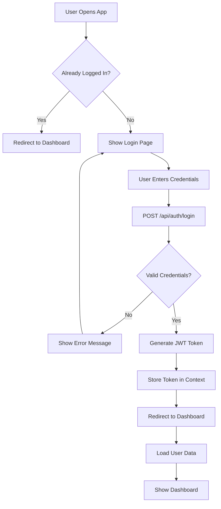
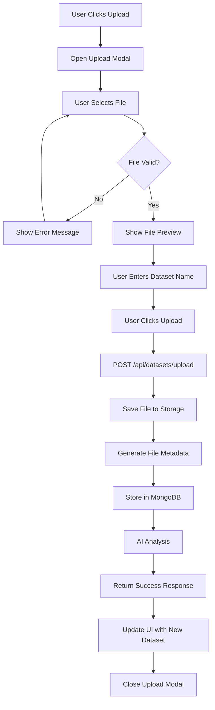
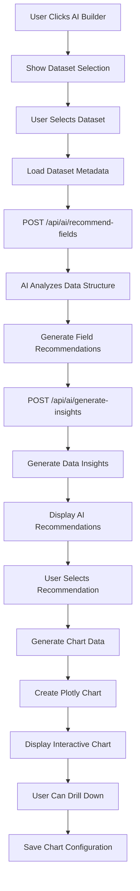
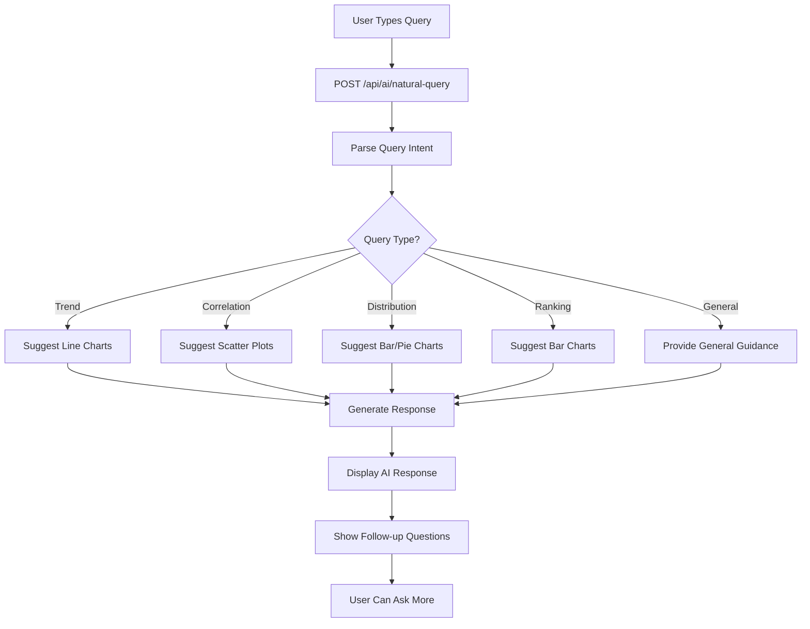
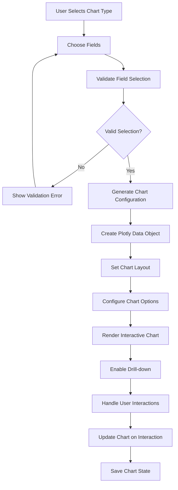
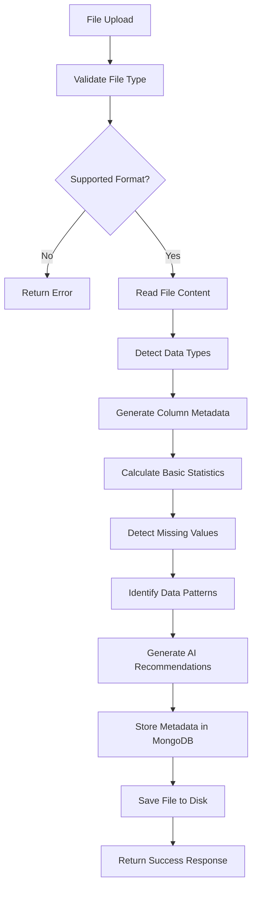
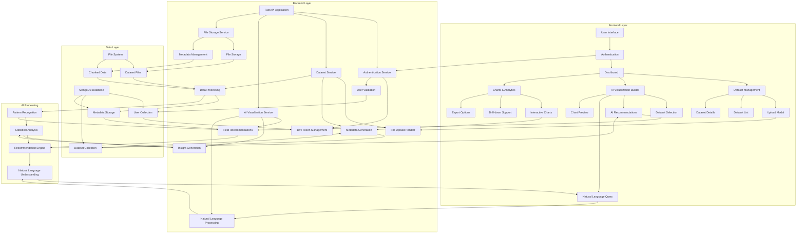
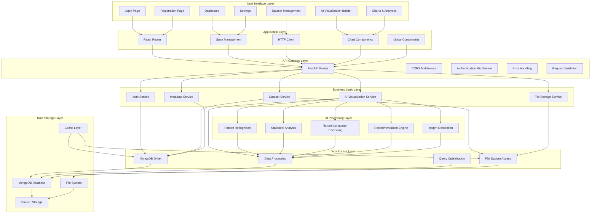

# DataSage Flow Diagrams

## 🔄 Individual Flow Diagrams

### 1. User Authentication Flow



### 2. Dataset Upload Flow



### 3. AI Visualization Flow



### 4. Natural Language Query Flow



### 5. Chart Generation Flow



### 6. Data Processing Flow



## 🎯 Complete System Flow Chart



## 🖼️ Visual Flow Diagrams

### 1. User Journey Flow

```
┌─────────────────┐    ┌─────────────────┐    ┌─────────────────┐
│   Landing Page  │───▶│   Login/Register│───▶│    Dashboard    │
└─────────────────┘    └─────────────────┘    └─────────────────┘
                                                        │
                                                        ▼
┌─────────────────┐    ┌─────────────────┐    ┌─────────────────┐
│   AI Builder    │◀───│   Datasets      │───▶│     Charts      │
└─────────────────┘    └─────────────────┘    └─────────────────┘
```

### 2. Data Processing Pipeline

```
┌─────────────┐    ┌─────────────┐    ┌─────────────┐    ┌─────────────┐
│ File Upload │───▶│ Validation  │───▶│ Processing  │───▶│ AI Analysis │
└─────────────┘    └─────────────┘    └─────────────┘    └─────────────┘
       │                   │                   │                   │
       ▼                   ▼                   ▼                   ▼
┌─────────────┐    ┌─────────────┐    ┌─────────────┐    ┌─────────────┐
│ File Storage│    │ Type Detect │    │ Metadata    │    │ Insights    │
└─────────────┘    └─────────────┘    └─────────────┘    └─────────────┘
```

### 3. AI Recommendation Engine

```
┌─────────────┐    ┌─────────────┐    ┌─────────────┐    ┌─────────────┐
│ Data Input  │───▶│ Pattern     │───▶│ Statistical │───▶│ Chart       │
│             │    │ Recognition │    │ Analysis    │    │ Suggestions │
└─────────────┘    └─────────────┘    └─────────────┘    └─────────────┘
       │                   │                   │                   │
       ▼                   ▼                   ▼                   ▼
┌─────────────┐    ┌─────────────┐    ┌─────────────┐    ┌─────────────┐
│ Column      │    │ Data Type   │    │ Correlation │    │ Confidence  │
│ Analysis    │    │ Detection   │    │ Detection   │    │ Scoring     │
└─────────────┘    └─────────────┘    └─────────────┘    └─────────────┘
```

## 🔄 Complete System Architecture Flow



## 📊 Key Process Flows

### 1. End-to-End User Experience

```
User Registration → Email Verification → Login → Dashboard → 
Dataset Upload → AI Analysis → Chart Generation → 
Interactive Visualization → Export/Share
```

### 2. Data Processing Pipeline

```
File Upload → Validation → Type Detection → 
Metadata Generation → AI Analysis → Storage → 
API Response → Frontend Update
```

### 3. AI Recommendation Process

```
Data Input → Pattern Analysis → Statistical Processing → 
Recommendation Generation → Confidence Scoring → 
UI Presentation → User Selection → Chart Creation
```

### 4. Security Flow

```
Request → Authentication Check → Authorization → 
Rate Limiting → Input Validation → 
Business Logic → Response → Audit Logging
```

## 🎯 Performance Optimization Flows

### 1. Caching Strategy

```
Request → Cache Check → Cache Hit? → 
Yes: Return Cached Data → No: Process Request → 
Store in Cache → Return Response
```

### 2. File Processing

```
Large File → Chunked Reading → Parallel Processing → 
Metadata Generation → Background Storage → 
Progress Updates → Completion Notification
```

### 3. Database Optimization

```
Query → Index Check → Query Optimization → 
Execution Plan → Result Caching → 
Response → Cache Update
```

This comprehensive flow diagram documentation provides a complete view of how DataSage operates, from user interactions to data processing and AI analysis. Each flow is designed to be efficient, secure, and user-friendly while maintaining high performance and scalability.
