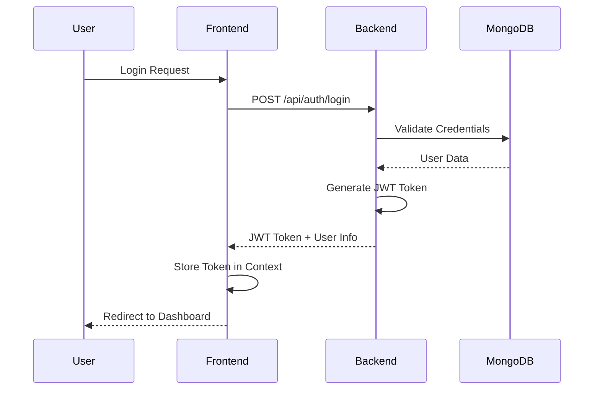
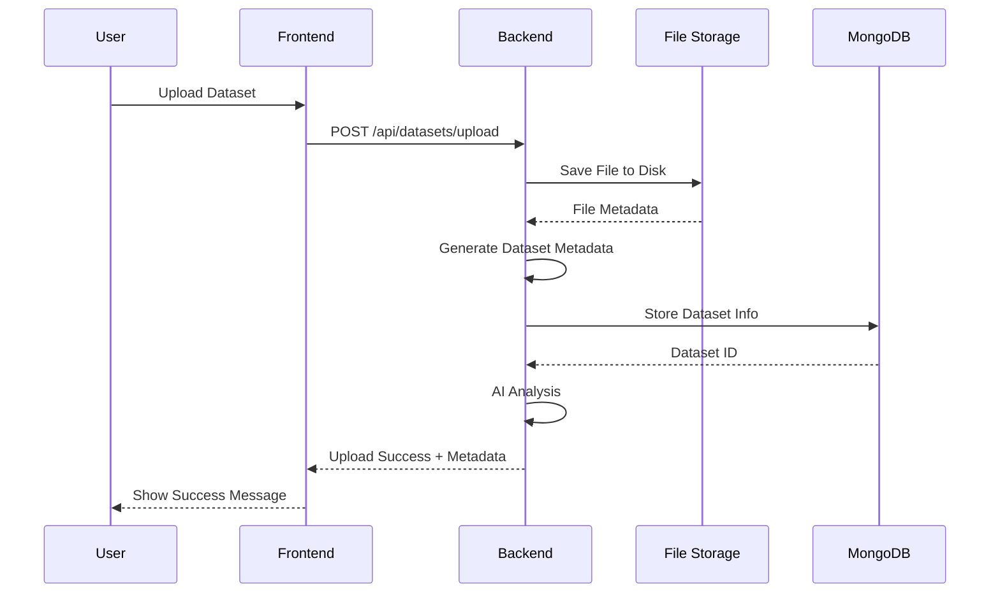
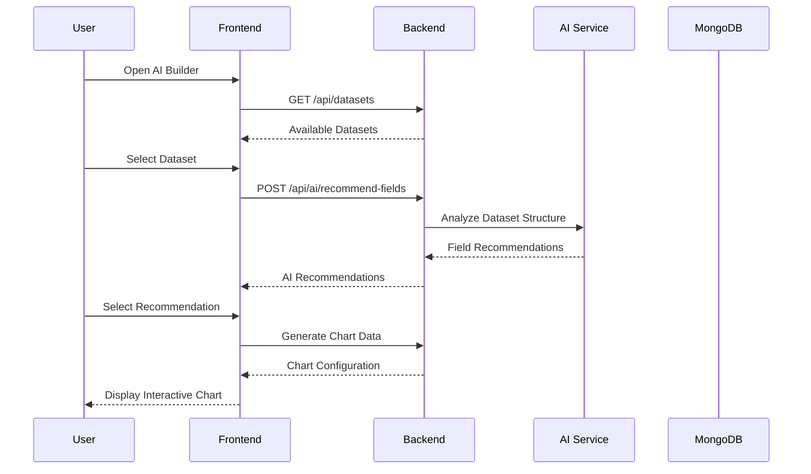

# DataSage - AI-Powered Data Exploration and Visualization Platform

## 🚀 Project Overview

DataSage is an intelligent data exploration and visualization platform that leverages AI to help users discover insights from their datasets. Built with modern web technologies, it provides a Power BI-like experience with advanced AI capabilities for automated chart recommendations, natural language queries, and intelligent data analysis.

## ✨ Key Features

### 🤖 AI-Powered Intelligence
- **Smart Field Recommendations**: AI analyzes your data structure and suggests optimal field combinations for visualization
- **Intelligent Chart Suggestions**: Automatically recommends the best chart types based on data patterns and relationships
- **Natural Language Queries**: Ask questions about your data in plain English (e.g., "Show me sales trends" or "What's the correlation between...")
- **AI-Generated Insights**: Get automated insights about data quality, patterns, and recommendations
- **Contextual Analysis**: AI understands your data context and provides relevant suggestions

### 📊 Advanced Visualization
- **Interactive Plotly Charts**: Rich, interactive visualizations with drill-down capabilities
- **Multiple Chart Types**: Bar charts, line charts, scatter plots, pie charts, area charts, gauges, and more
- **Real-time Data Processing**: Handle large datasets with efficient chunked processing
- **Responsive Design**: Charts adapt to different screen sizes and devices
- **Export Capabilities**: Download charts and data in various formats

### 🔐 Enterprise-Grade Security
- **JWT Authentication**: Secure user authentication with JSON Web Tokens
- **Password Hashing**: Bcrypt encryption for password security
- **User Isolation**: Each user's data is completely isolated and secure
- **CORS Protection**: Properly configured cross-origin resource sharing

### 📁 Flexible Data Management
- **Multiple File Formats**: Support for CSV, Excel (XLSX/XLS), and JSON files
- **Hybrid Storage**: Metadata in MongoDB, large files on disk for optimal performance
- **Real-time Upload**: Progress tracking and validation during file uploads
- **Data Validation**: Automatic data type detection and validation
- **Metadata Generation**: Automatic generation of comprehensive dataset metadata

## 🏗️ Architecture Design

### System Architecture

```
┌─────────────────────────────────────────────────────────────────┐
│                        DataSage Platform                        │
├─────────────────────────────────────────────────────────────────┤
│  Frontend (React + Vite)          │  Backend (FastAPI + Python) │
│  ┌─────────────────────────────┐   │  ┌─────────────────────────┐ │
│  │     User Interface Layer    │   │  │    API Gateway Layer    │ │
│  │  ┌─────────────────────────┐│   │  │  ┌─────────────────────┐│ │
│  │  │   Authentication UI     ││   │  │  │   FastAPI Router    ││ │
│  │  │   Dashboard UI          ││   │  │  │   CORS Middleware   ││ │
│  │  │   Dataset Management    ││   │  │  │   Error Handling    ││ │
│  │  │   AI Visualization      ││   │  │  └─────────────────────┘│ │
│  │  │   Charts & Analytics    ││   │  └─────────────────────────┘ │
│  │  └─────────────────────────┘│   │  ┌─────────────────────────┐ │
│  │  ┌─────────────────────────┐│   │  │    Business Logic       │ │
│  │  │   State Management      ││   │  │  ┌─────────────────────┐│ │
│  │  │   Context API           ││   │  │  │  Auth Service       ││ │
│  │  │   React Router          ││   │  │  │  Dataset Service    ││ │
│  │  │   HTTP Client (Axios)   ││   │  │  │  AI Service         ││ │
│  │  └─────────────────────────┘│   │  │  │  File Storage       ││ │
│  └─────────────────────────────┘   │  │  └─────────────────────┘│ │
│                                    │  └─────────────────────────┘ │
│                                    │  ┌─────────────────────────┐ │
│                                    │  │    Data Layer           │ │
│                                    │  │  ┌─────────────────────┐│ │
│                                    │  │  │  MongoDB Database   ││ │
│                                    │  │  │  File System        ││ │
│                                    │  │  │  Data Processing    ││ │
│                                    │  │  └─────────────────────┘│ │
│                                    │  └─────────────────────────┘ │
└─────────────────────────────────────────────────────────────────┘
```

### Technology Stack

#### Frontend
- **React 18**: Modern UI library with hooks and functional components
- **Vite**: Fast build tool and development server
- **TypeScript**: Type-safe JavaScript for better development experience
- **Tailwind CSS**: Utility-first CSS framework for rapid UI development
- **React Router**: Client-side routing for single-page application
- **Plotly.js**: Interactive data visualization library
- **Axios**: HTTP client for API communication
- **React Hot Toast**: User notification system
- **Lucide React**: Beautiful icon library

#### Backend
- **FastAPI**: Modern, fast web framework for building APIs
- **Python 3.9+**: High-level programming language
- **MongoDB**: NoSQL database for flexible data storage
- **Motor**: Async MongoDB driver for Python
- **Pydantic**: Data validation and settings management
- **JWT**: JSON Web Tokens for authentication
- **Bcrypt**: Password hashing library
- **Pandas**: Data manipulation and analysis library
- **NumPy**: Numerical computing library
- **python-multipart**: File upload handling

#### AI & Machine Learning
- **Custom AI Service**: Intelligent data analysis and recommendations
- **Pattern Recognition**: Automatic detection of data patterns and relationships
- **Natural Language Processing**: Query understanding and response generation
- **Statistical Analysis**: Automated statistical insights generation

## 🔄 Data Flow Architecture

### 1. User Authentication Flow



### 2. Dataset Upload Flow



### 3. AI Visualization Flow



## 🚀 Getting Started

### Prerequisites

- Node.js 16+ and npm
- Python 3.9+
- MongoDB 4.4+
- Git

### Installation

1. **Clone the repository**
   ```bash
   git clone https://github.com/yourusername/datasage.git
   cd datasage
   ```

2. **Backend Setup**
   ```bash
   cd version2/backend
   pip install -r requirements.txt
   python main.py
   ```

3. **Frontend Setup**
   ```bash
   cd version2/frontend
   npm install
   npm run dev
   ```

4. **Database Setup**
   - Ensure MongoDB is running on localhost:27017
   - The application will automatically create necessary collections

### Environment Variables

Create a `.env` file in the backend directory:

```env
MONGODB_URL=mongodb://localhost:27017/datasage
JWT_SECRET_KEY=your-secret-key-here
JWT_ALGORITHM=HS256
JWT_ACCESS_TOKEN_EXPIRE_MINUTES=30
```

## 📁 Project Structure

```
datasage/
├── version1/                    # Legacy version (archived)
├── version2/                    # Current version
│   ├── frontend/               # React frontend application
│   │   ├── src/
│   │   │   ├── components/     # Reusable UI components
│   │   │   │   ├── AIVisualizationBuilder.jsx
│   │   │   │   ├── PlotlyChart.jsx
│   │   │   │   ├── UploadModal.jsx
│   │   │   │   └── ConfirmationModal.jsx
│   │   │   ├── contexts/       # React contexts
│   │   │   │   └── AuthContext.jsx
│   │   │   ├── pages/          # Page components
│   │   │   │   ├── Dashboard.jsx
│   │   │   │   ├── Datasets.jsx
│   │   │   │   └── Charts.jsx
│   │   │   ├── App.jsx         # Main application component
│   │   │   └── main.jsx        # Application entry point
│   │   ├── public/             # Static assets
│   │   ├── package.json        # Frontend dependencies
│   │   └── vite.config.js      # Vite configuration
│   └── backend/                # FastAPI backend application
│       ├── services/           # Business logic services
│       │   ├── auth_service.py
│       │   ├── enhanced_dataset_service.py
│       │   ├── ai_visualization_service.py
│       │   └── file_storage_service.py
│       ├── models/             # Data models and schemas
│       │   └── schemas.py
│       ├── main.py             # FastAPI application entry point
│       ├── database.py         # Database connection
│       └── requirements.txt    # Python dependencies
└── README.md                   # This file
```

## 🔧 API Documentation

### Authentication Endpoints

- `POST /api/auth/register` - User registration
- `POST /api/auth/login` - User login
- `POST /api/auth/logout` - User logout
- `GET /api/auth/me` - Get current user info

### Dataset Endpoints

- `POST /api/datasets/upload` - Upload new dataset
- `GET /api/datasets` - List user datasets
- `GET /api/datasets/{id}` - Get dataset details
- `DELETE /api/datasets/{id}` - Delete dataset
- `GET /api/datasets/{id}/data` - Get dataset data with pagination
- `GET /api/datasets/{id}/summary` - Get dataset summary statistics

### AI Endpoints

- `POST /api/ai/recommend-fields` - Get AI field recommendations
- `POST /api/ai/generate-insights` - Generate AI insights
- `POST /api/ai/natural-query` - Process natural language queries

## 🎯 Key Enhancements Implemented

### 1. AI-Powered Visualization Builder
- **Smart Recommendations**: AI analyzes data structure and suggests optimal visualizations
- **Natural Language Interface**: Users can ask questions about their data in plain English
- **Contextual Insights**: AI provides data quality assessments and pattern recognition
- **Intelligent Field Selection**: AI recommends the best field combinations for each chart type

### 2. Advanced Data Processing
- **Hybrid Storage System**: Metadata in MongoDB, large files on disk for optimal performance
- **Chunked Processing**: Efficient handling of large datasets without memory issues
- **Automatic Type Detection**: AI-powered data type detection and validation
- **Real-time Metadata Generation**: Comprehensive dataset analysis and insights

### 3. Interactive Visualization Engine
- **Plotly.js Integration**: Rich, interactive charts with drill-down capabilities
- **Multiple Chart Types**: Support for 7+ chart types with AI recommendations
- **Responsive Design**: Charts adapt to different screen sizes and devices
- **Export Functionality**: Download charts and data in various formats

### 4. Enhanced User Experience
- **Power BI-like Interface**: Familiar, intuitive design for data professionals
- **Real-time Feedback**: Progress tracking and validation during operations
- **Custom Modals**: Beautiful, accessible confirmation and upload modals
- **Error Handling**: Comprehensive error handling with user-friendly messages

### 5. Security & Performance
- **JWT Authentication**: Secure, stateless authentication system
- **Password Hashing**: Bcrypt encryption for password security
- **CORS Protection**: Properly configured cross-origin resource sharing
- **Data Isolation**: Complete user data separation and security

## 🔮 Future Enhancements

### Phase 2: Advanced AI Features
- **Machine Learning Models**: Integration with scikit-learn for predictive analytics
- **Automated Report Generation**: AI-generated insights and reports
- **Advanced NLP**: More sophisticated natural language query processing
- **Custom AI Models**: Train custom models on user data

### Phase 3: Enterprise Features
- **Multi-tenant Architecture**: Support for multiple organizations
- **Role-based Access Control**: Granular permissions and user roles
- **API Rate Limiting**: Advanced API protection and monitoring
- **Audit Logging**: Comprehensive activity tracking and compliance

### Phase 4: Advanced Analytics
- **Real-time Streaming**: Support for real-time data streams
- **Advanced Statistical Analysis**: More sophisticated statistical methods
- **Custom Visualizations**: User-defined chart types and templates
- **Collaboration Features**: Team sharing and collaboration tools

## 🤝 Contributing

We welcome contributions! Please see our [Contributing Guidelines](CONTRIBUTING.md) for details.

### Development Setup

1. Fork the repository
2. Create a feature branch
3. Make your changes
4. Add tests if applicable
5. Submit a pull request

## 📄 License

This project is licensed under the MIT License - see the [LICENSE](LICENSE) file for details.

## 🙏 Acknowledgments

- **Plotly.js** for excellent data visualization capabilities
- **FastAPI** for the modern, fast web framework
- **React** for the powerful UI library
- **MongoDB** for flexible data storage
- **Tailwind CSS** for rapid UI development

## 📞 Support

For support, email support@datasage.ai or join our Slack community.

---

**DataSage** - Empowering data-driven decisions with AI-powered insights 🚀
